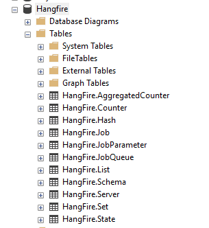
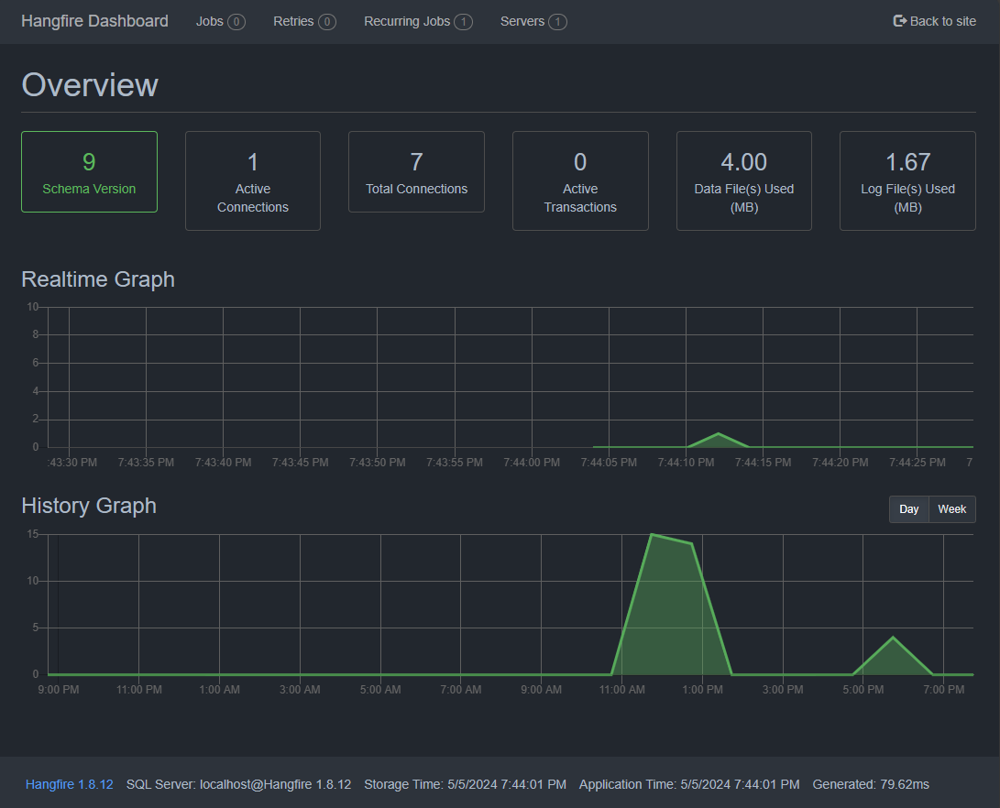

# BackgroundWorkerExample

## IHostedService, IHostedLifecycleService
While `IHostedService` provides a solid foundation for background tasks in ASP.NET Core, .NET 8 introduces `IHostedLifecycleService` to offer even more granular control over the application lifecycle. This interface inherits from `IHostedService` and adds additional methods for specific lifecycle events.

#### Functionality of IHostedLifecycleService
- Methods
	- Inherits `StartAsync(CancellationToken)` and `StopAsync(CancellationToken)` from `IHostedService`.
    - `Starting(CancellationToken cancellationToken)`: This method is called just ater `StartAsync` is invoked. It allows for any post-startup actions.
    - `StartedAsync(CancellationToken cancellationToken)`: This method is called just before `StartAsync` is invoked. It allows for any pre-startup actions before the actual background task begins.
    - `StoppingAsync(CancellationToken cancellationToken)`: This method is called just before `StopAsync` is invoked. It allows for any pre-shutdown actions before the background task is stopped.
    - `StoppedAsync()`: This method is called after `StopAsync` has completed. You can use it for any post-shutdown cleanup or logging.

### Implementations
Implementation can be found in [HostedBackgroundService](HostedBackgroundService).

[`SampleIHostedService.cs`](HostedBackgroundService/Services/SampleIHostedService.cs) file holds the actual implementation of the background tasks. This service is registered in [`Program.cs`](HostedBackgroundService/Program.cs) through
```
builder.Services.AddHostedService<SampleIHostedService>();
```

- - -

## BackgroundService
`BackgroundService` is a concrete class provided by ASP.NET Core that inherits from the `IHostedService` interface. It offers a simplified approach to creating long-running background tasks within your application.

While `IHostedService` defines the core functionality for background services, `BackgroundService` provides a more convenient way to implement it. It reduces boilerplate code by handling some aspects of the lifecycle management automatically.

#### Functionality
- Inherits from `IHostedService`: `BackgroundService` inherits all the functionality of `IHostedService`, including the `StartAsync(CancellationToken cancellationToken)` and `StopAsync(CancellationToken cancellationToken)` methods.
- `ExecuteAsync(CancellationToken cancellationToken)`: This abstract method serves as the entry point for your background service's logic. You override this method to define the actual work your background task performs. The cancellation token allows for graceful termination during application shutdown.

### Implementation
Implementation can be found in [BackgroundService](BackgroundService).

[`SampleBackgroundService.cs`](BackgroundService/Services/SampleBackgroundService.cs) file holds the actual implementation of the background tasks. This service is registered in [`Program.cs`](BackgroundService/Program.cs) through
```
builder.Services.AddHostedService<SampleBackgroundService>();
```
`ExecuteAsync()` is overridden to implement the background task logic. It continuously loops until the cancellation token is signaled, performing work within the loop and simulating a delay between iterations.
- - -

## WorkerService

#### Creating a Worker Service Project:
ASP.NET Core provides a convenient Worker Service template to kickstart your project quickly. You can use the .NET CLI or Visual Studio to access this template.
```
dotnet new worker -o my-custom-worker
```

### Hosting Worker Service
Unlike traditional console applications or ASP.NET Core web apps, Worker Services themselves do not dictate how they should be hosted. This flexibility allows you to choose the hosting method that best aligns with your application's requirements.
**Here are some common hosting options:**
- **Scheduler-Triggered Console Application:**
	- Use tools like Windows Scheduled Tasks, Kubernetes cron jobs, Azure Logic Apps, AWS Scheduled Tasks, or GCP Cloud Scheduler to periodically execute a console application that starts your Worker Service.
- **Windows Service or systemd (Windows/Linux):**
	- For dedicated background task environments, consider creating a Windows Service (for Windows) or using systemd (on Linux) to host and manage your Worker Service as a long-running process.

### When to use worker services?
- **Out-of-Process Background Tasks:** Worker Services are ideal when you want your background tasks to run independently of a web application, providing greater isolation and resilience.
- **Prefer External Hosting: **If you prefer deploying your background tasks separately from your web application (e.g., containerized microservices), Worker Services offer a suitable solution.
- **Avoid App Pool Recycles:** Worker Services, when hosted externally, can circumvent web application pool recycles, ensuring uninterrupted background task execution.
- **Natural Migration Path:** If you're migrating existing full .NET Framework Windows Services to ASP.NET Core, Worker Services provide a natural transition path with a familiar background task management approach.

### Implementation
Implementation can be found in [WorkerServiceExample](WorkerServiceExample).

[`Worker.cs`](WorkerServiceExample/Worker.cs) file holds the actual implementation of the background tasks. This service is registered in [`Program.cs`](WorkerServiceExample/Program.cs) through
```
var builder = Host.CreateDefaultBuilder(args)
    .UseWindowsService()
    .UseSystemd()
    .ConfigureServices((_, services) =>
    {
        services.AddHostedService<Worker>();
    });
```

- - -

## Hangfire
Hangfire is a popular open-source library for managing background jobs and scheduling tasks within .NET applications (including ASP.NET Core).

**There are different types of jobs that are present in the Hangfire:**
- **Fire-and-Forget Job:** Fire and Forget jobs are execute only one time after certain conditions that we provide.
- **Delayed Job:** A delayed job is execute only once but after a specific interval of time.
- **Recurring Job:** Recurring Job is execute many times after specified condition and time interval
- **Continuous Job:** Continuation job is execute when its parent job is executed and finished.

### Implementation
Implementation for Hangfire can be found in [HangfireExample](HangfireExample).

In [`Program.cs`](HangfireExample/Program.cs), services and middleware related to Hangfire is configured.
```
builder.Services.AddHangfire(configuration => configuration
    .SetDataCompatibilityLevel(CompatibilityLevel.Version_170)
    .UseSimpleAssemblyNameTypeSerializer()
    .UseRecommendedSerializerSettings()
    .UseSqlServerStorage(
        hangfireConnectionString,
        new SqlServerStorageOptions
        {
            CommandBatchMaxTimeout = TimeSpan.FromMinutes(5),
            SlidingInvisibilityTimeout = TimeSpan.FromMinutes(5),
            QueuePollInterval = TimeSpan.Zero,
            UseRecommendedIsolationLevel = true,
            DisableGlobalLocks = true,
        }));

builder.Services.AddHangfireServer();
```

It will create the following tables in the database related to Hangfire to manage jobs.



The Hangfire Dashboard empowers you to effortlessly manage your background tasks in ASP.NET Core. This robust web interface acts as your central hub, offering comprehensive insights and control over your background jobs. Add dashboard through:
```
app.UseHangfireDashboard("/dashboard");
```
Then we will get an interactive dashboard at `localhost:port/dashboard`.



Recurring job [`TestRecurringJob.cs`](HangfireExample/Jobs/TestRecurringJob.cs) is configred to run minutely by
```
RecurringJob.AddOrUpdate(
	"MyJob",
    () => app.Services.GetRequiredService<ITestRecurringJob>().RunAsync(),
    Cron.Minutely);
```

To run job immediately and schedule jobs, some actions i.e. apis are added in [`HangfireTestController.cs`](HangfireExample/Controller/HangfireTestController.cs).

```
[HttpGet]
[Route("immediate/{id}")]
public string Immediate(int id)
{
    var jobId = BackgroundJob.Enqueue(() => testJob.RunAsync(id, "immediate"));
    return $"Job ID: {jobId}. Job started with value {id}";
}

[HttpGet]
[Route("schedule/{id}")]
public string Schedule(int id)
{
    var jobId = BackgroundJob.Schedule(() => testJob.RunAsync(id, "schedule"), TimeSpan.FromSeconds(20));
    return $"Job ID: {jobId}. Job will start after 20 second";
}
```